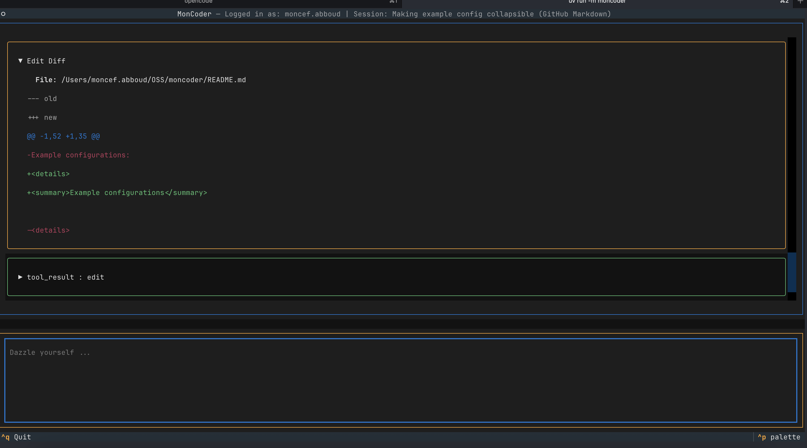

# MonCoder

An interactive CLI tool that helps users with software engineering tasks using AI assistance. This is a learning project, heavily based and inspired by the excellent Opencode. I'm experimenting with different features like using SQLite for session storage and load-on-demand tools. This is very much a WIP and built for fun.

## Features

- Interactive chat interface for coding assistance.
- AI-powered code editing, searching, and debugging.
- Session management for ongoing conversations, stored in SQLite and accessible via the palette.
- Built with Textual for a modern terminal UI.
- Supports multiple LLM providers via LiteLLM.



## Installation

Clone the repository:

```sh
git clone https://github.com/CefBoud/Moncoder
cd moncoder
```

 ## Configuration

To configure your LLM provider, copy the example environment file and edit it:

```bash
cp .env.example .env
```

Edit `.env` to uncomment and set your API keys for the desired provider. See the [LiteLLM documentation](https://docs.litellm.ai/docs/providers) for supported models and API key variables.

<details>
<summary>Example configurations</summary>

- **OpenAI**:
  ```bash
  OPENAI_API_KEY="your-api-key"
  MODEL="gpt-4o"
  ```

- **Anthropic**:
  ```bash
  ANTHROPIC_API_KEY="your-api-key"
  MODEL="claude-sonnet-4-5-20250929"
  ```

- **Gemini**:
  ```bash
  GEMINI_API_KEY="your-api-key"
  MODEL="gemini/gemini-pro"
  ```

- **OpenRouter**:
  ```bash
  OPENROUTER_API_KEY="your-api-key"
  MODEL="openrouter/x-ai/grok-4-fast:free"
  ```

- **OpenAI Compatible**:
  ```bash
  API_KEY="your-api-key"
  MODEL="openai/qwen/qwen3-coder"
  API_BASE="https://your-endpoint/v1/"
  ```

</details>

The configuration is loaded in `moncoder/config.py`.

### Additional Notes

- Logging: Logs are written to `~/.local/share/moncoder/log/app.log` (XDG-based path).
- Dependencies: 
  * `Textual` for TUI 
  * `LiteLLM` for LLM integration


 ## Usage

Run the application:

```bash
uv run -m moncoder
```

Use the interactive CLI for coding assistance, including editing, searching, and debugging. Switch sessions via the palette `ctrl+p`


## Roadmap

- [ ] Better auth
- [ ] Permissions
- [ ] Build/Plan modes
- [ ] Subagents
- [ ] LSP integration 